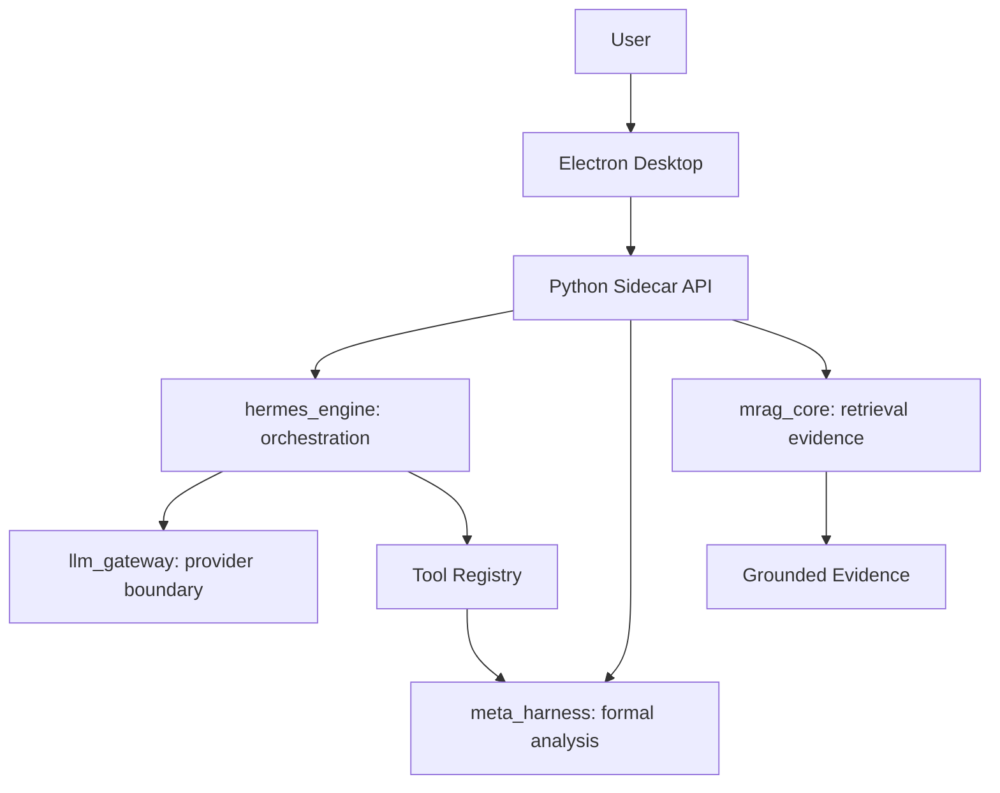

# PycHermesAgent Project Development and Release Governance

**Document status:** Production-governance baseline
**Project version line:** v0.2.x engineering preview to production release
**Authority:** This document is the top-level operating contract for future Cursor-driven development, verification, release, push, and tag operations.

## 1. Purpose

PycHermesAgent is being developed into a Windows-first, local-first agent platform composed of `hermes_engine`, `meta_harness`, `llm_gateway`, `mrag_core`, `sidecar_api`, asset/artifact services, and an Electron desktop shell. The repository is currently an internal engineering preview. This governance document defines the path from that preview state to a production-grade and release-grade product.

Future agents must use this document as the first reference before changing architecture, implementing features, creating release commits, pushing to remotes, or creating tags. Lower-level design documents may add detail, but they must not weaken the boundaries or release gates defined here.

## 2. Current State Baseline

The current repository has these validated capabilities:

- Contract-tested Python package and local sidecar API.
- Minimal stdlib HTTP sidecar transport with JSON and SSE surfaces.
- `llm_gateway` runtime paths for OpenAI-compatible, OpenRouter, and GitHub Copilot style chat completion.
- Product-owned `hermes_engine.AgentLoop` with tool calls, session persistence, bounded memory injection, heuristic planning, retry budgeting, and event streaming.
- `meta_harness.MetaFramework.execute()` as the formal-analysis entry point with legacy bridge execution and degraded-state reporting.
- `mrag_core` text knowledge bases with chunking, lexical retrieval, and JSON persistence.
- Local asset promotion and artifact export foundations.
- Sidecar inventory routes for installed model assets and exported artifacts (`GET /assets`, `GET /artifacts`).

**Engineering-preview line (contract-tested)** also includes MRAG storage ownership/locks; sidecar request-ID and AgentLoop/SSE correlation; explicit skill runtime metadata on sidecar listing surfaces, **`SKILLS_RUNTIME_POLICY`** on **`AgentLoop` `start` events**, and accepted ADR deferral of script execution; MetaHarness dependency snapshots plus benchmark smoke and value-proof export hooks; MRAG file/URL ingest, on-disk manifest/index version gates, and chunk-index rebuild; structured HTTP error domains; `GET /runtime-paths` and `GET /favicon.ico` (204); preview Electron shell (health, runtime paths, `sidecar_url.txt`, refresh with backoff); and **`scripts/release_gates.py`** with **ruff + mypy** in CI plus optional MetaHarness export plus preview release-notes generation.

**Phase 2 / production path (partially automated):** hybrid MRAG retrieval modes (`lexical` / `semantic` trigram / `hybrid`); structured log format via **`PYC_HERMES_LOG_FORMAT=json`**; MRAG migrate planner CLI; **`RELEASE_GATES_PRODUCTION`** runs **`uv lock --check`**, migrate smoke, and **desktop `electron-builder --dir`**; CI **`production-gates`** job on **`main`**. Full Windows installers, signing, updaters, and neural embedders remain future work — see **`docs/deployment/Production_Release_Gates.md`**.

**Phase 2 completed (v0.3.0):** SQLite/FTS5 storage engine replaces JSON for MRAG chunks; 15-case external MetaHarness benchmark (wins 3/4 metrics vs raw LLM); 8 builtin skills (4 prompt + 4 analysis) with audit tracking; `analysis_mode` (casual/structured/formal) with analysis cards; three-layer memory (`UserPreferences`); health state machine with component probes; sidecar routes for preferences, PDF ingest, skill audit; Dify-style Electron desktop with SSE streaming, Markdown/Shiki/Mermaid/ECharts/KaTeX rendering, session management, settings, dark/light theme, slash commands, citation panel; electron-builder NSIS installer config; electron-updater auto-update; 284 contract + integration tests passing.

The repository remains **not production-ready** because it still lacks production-scale storage migration, broad semantic retrieval (neural embeddings), hardened desktop packaging/updater/CI (code signing), full observability, and verified end-to-end install/upgrade beyond the preview scope.

## 3. Product Direction

The product goal is not to clone the full upstream Hermes runtime. The accepted direction is:



The product must keep Hermes-style memory and skill ideas, but product orchestration belongs to `hermes_engine`. MetaHarness remains a quality and method harness, not a general runtime.

## 4. Non-Negotiable Boundaries

These rules are mandatory for all development:

- Formal analysis must enter through `MetaFramework.execute()`.
- `hermes_engine` owns orchestration, session state, memory injection, tool loop, and recovery behavior.
- `meta_harness` owns method selection, method review, logic/reasonableness review, evidence grades, risks, recommendations, and degraded-state annotation.
- `llm_gateway` is the only provider/model/auth/config compatibility and execution boundary.
- Provider-specific SDK or native response objects must not leak outside `llm_gateway`.
- `mrag_core` owns ingestion, indexing, retrieval, reranking, and evidence packaging only.
- `mrag_core` must not become a mixed store for logs, model assets, chat memory, or rendered artifacts.
- Install directories are read-only. Configuration goes to roaming application data. Logs, caches, indexes, downloads, models, and artifacts go to local application data.
- CE and SR grading must remain separate.
- Predictive outputs must not be represented as intervention-grade causal claims.

## 5. Adopted Findings From the Evaluation Report

The evaluation report is retained as a historical assessment and risk register. The following findings are adopted into the production plan:

- MetaHarness value must be proven with benchmark evidence, not only architectural claims.
- `MethodSelector`, `CapabilityRegistry`, and `MethodJudge` must evolve beyond keyword and template behavior.
- Skill support must advance from discovery and metadata parsing to explicit runtime lifecycle management.
- MRAG must evolve from lexical JSON MVP to locked persistence, migration, richer ingestion, and later semantic retrieval/reranking.
- Quality gates must include contract tests, smoke tests, persistence restart tests, release checks, and regression tests.

The recommendation to completely abandon the product runtime and become only a pure methodology layer is not adopted as the main project direction. The useful part of that recommendation is adopted as a design constraint: `meta_harness` must remain usable as a future pluggable quality layer for external runtimes.

## 6. Development Phases

### Phase 1A: MRAG Storage Ownership

Goal: protect the current JSON persistence boundary in code.

Required outcomes:

- Single-process ownership or file-lock guardrail for MRAG storage roots.
- Clear error envelope when storage is locked.
- Tests for same-process reuse, second-owner rejection, release, restart, and sidecar error mapping.

### Phase 1B: Trace and Request Correlation

Goal: every sidecar request and stream event can be correlated.

Required outcomes:

- Stable request ID propagation from HTTP to service layer.
- Agent loop event correlation with request ID, trace ID, sequence, and terminal state.
- Error envelopes include correlation data.
- Logs and SSE events can be joined by request ID.

### Phase 1C: Skill Runtime Lifecycle MVP

Goal: move from skill metadata to explicit and safe runtime binding.

Required outcomes:

- Skill activation must be explicit.
- `SKILL.md` content may be injected as controlled context only when requested.
- Script execution remains disabled until a permissions model exists.
- Skill source, version, and activation metadata are visible through sidecar surfaces.

### Phase 1D: MetaHarness Value Proof

Goal: prove that MetaHarness improves reliability.

Required outcomes:

- Capability availability reflects actual bridge and dependency state.
- Method routing uses task type, data shape, and method preconditions.
- Benchmark suite compares baseline LLM behavior against MetaHarness-guided behavior.
- Metrics include causal overclaim reduction, risk detection, method selection accuracy, degraded-state correctness, and evidence-grade correctness.

### Phase 1E: MRAG Retrieval Productization

Goal: make local retrieval useful without violating storage boundaries.

Required outcomes:

- HTTP surfaces for file and URL text ingestion.
- Index manifests with version checks and rebuild/migration behavior.
- Preserved citations and source URIs.
- Decision record for JSON vs SQLite/FTS5 vs vector indexing (`docs/design/MRAG_Index_Strategy_Decision_v0.2.0.md`).

### Phase 2: Asset, Artifact, and Sidecar Hardening

Goal: expose model assets and artifacts through stable contracts.

Required outcomes:

- Sidecar routes for asset inventory and artifact listing/export.
- Crash-safe promotion strategy documented and tested for supported platforms.
- Structured error semantics across asset, artifact, LLM, MRAG, and MetaHarness domains.

### Phase 3: Electron Desktop Shell

Goal: deliver an installable desktop experience.

Required outcomes:

- Desktop lifecycle owns sidecar launch, health display, settings, logs, artifacts, and user flows.
- Desktop never writes mutable runtime state into the install directory.
- Desktop UI tests remain last priority after contract and integration stability.

**Preview (v0.2.x):** a minimal probe-only shell exists under `desktop/` (see `desktop/README.md`). It does not satisfy production packaging, updater, or path-policy gates until Phase 4 completes.

### Phase 4: Release Hardening

Goal: prepare production-grade release candidates.

Required outcomes:

- Full release checklist automated where safe.
- Version and tag rules enforced.
- Upgrade, downgrade, and migration behavior tested.
- Security and secret scans pass.
- Release notes generated from verified changes.

## 7. Cursor Conditional Automation Authority

Cursor is conditionally authorized to perform development, verification, git push, tag creation, and release preparation only when all of the following are true:

1. The requested task is covered by this governance document and the lower-level design documents.
2. All required tests and checks for the affected phase pass.
3. The working tree contains only classified and intentional changes.
4. No secrets, credentials, tokens, private keys, or local environment files are included.
5. No unresolved Blocker or High severity review findings remain.
6. Version and tag names match the compatibility matrix.
7. Release notes and checkpoint summaries are generated before tag creation.
8. The remote target is the normal project remote and no force-push is required.

Cursor must stop and ask for human direction instead of pushing, tagging, or releasing when any gate fails, when credentials are missing, when a destructive git operation would be required, or when the target branch/tag policy is ambiguous.

## 8. Mandatory Verification Matrix

Minimum verification before a normal development commit:

```bash
./.venv/bin/python scripts/release_gates.py
```

This runs the contract suite, `git diff --check` (staged and unstaged), and a heuristic scan for common secret patterns in tracked text files. Equivalent manual pytest-only step:

```bash
./.venv/bin/python -m pytest tests/contract
```

Additional verification is required by scope:

- MRAG changes: persistence restart tests, lock/ownership tests, retrieval tests.
- LLM gateway changes: mock provider tests, stream parsing tests, auth failure tests.
- Agent loop changes: synchronous and SSE loop tests, retry and tool-call tests.
- MetaHarness changes: method routing, degraded-state, benchmark or smoke tests.
- Packaging changes: runtime path tests, asset promotion tests, install-directory immutability checks.
- Release changes: full contract suite, smoke server check, secret scan, git status classification, tag validation.

## 9. Release Gate Policy

A release candidate cannot be tagged until these gates pass:

- Gate 1: Architecture and constraints still match `AGENTS.md`.
- Gate 2: Contract tests pass.
- Gate 3: Runtime smoke test passes for sidecar health and at least one non-network path.
- Gate 4: Persistence restart behavior passes for modified storage domains.
- Gate 5: Version matrix is updated.
- Gate 6: Release notes describe features, fixes, tests, risks, and migration notes.
- Gate 7: No secrets or generated runtime assets are staged.
- Gate 8: Tag name and branch policy are valid.

## 10. Failure Rules

Development must stop when:

- A test failure cannot be explained with evidence.
- A planned phase requires architectural boundary changes not approved in this document.
- A provider SDK object would cross the `llm_gateway` boundary.
- MRAG storage would mix unrelated runtime assets.
- A release would require force push, skipped hooks, or unverified credentials.
- Production readiness would be claimed while any release gate is incomplete.

## 11. Document Maintenance Rules

Every material feature must update the relevant document before release:

- Architecture changes update `docs/architecture/*`.
- Runtime contract changes update detailed design, feature details, compatibility matrix, and deployment guide.
- Storage changes update MRAG constraints and compatibility matrix.
- Release process changes update this document and the deployment guide.
- Evaluation findings update the adoption decision section of the evaluation report.
