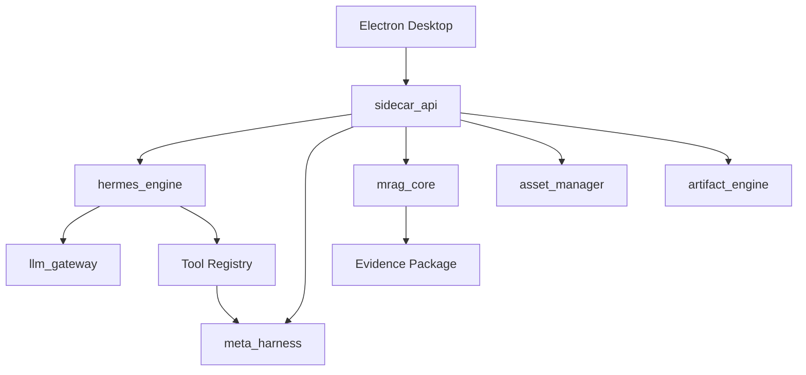
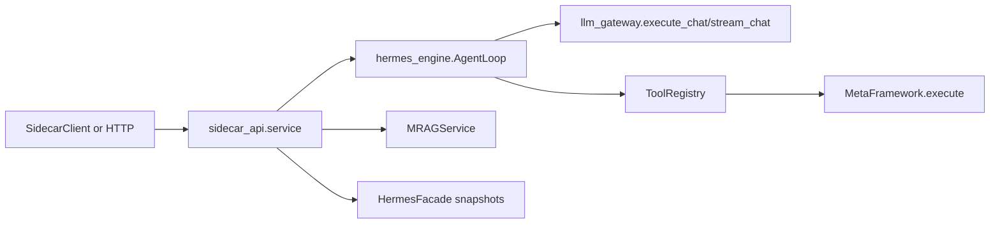

# PycHermesAgent Architecture v0.2.0

**Status:** Production-target architecture baseline
**Authority:** This document defines module ownership and boundary rules. Development and release governance is defined by `docs/Project_Development_and_Release_Governance.md`.

## 1. Product Architecture

PycHermesAgent is a Windows-first, local-first agent platform baseline. It combines a product-owned orchestration engine, a formal-analysis harness, provider-isolated LLM execution, local retrieval, stable sidecar contracts, and a future Electron shell.

The current repository implements the Python sidecar, LLM gateway MVP, Hermes read-only bridge snapshots, a product-owned agent loop, MetaHarness MVP, MRAG text/JSON MVP, and local asset/artifact foundations. The desktop shell and production release runtime are planned, not complete.

## 2. Module Ownership

| Module | Owns | Must Not Own |
|--------|------|--------------|
| `hermes_engine` | Orchestration, sessions, memory injection, tool loop, retry/recovery, product-owned AgentLoop | Formal method grading, provider auth, vector storage internals |
| `meta_harness` | Method selection, formal analysis, logic/reasonableness review, CE/SR grades, risks, recommendations, degraded state | General agent runtime, Electron state, provider SDKs, MRAG storage |
| `llm_gateway` | Provider/model/auth/config compatibility, chat execution, streaming execution, opencode-style config interpretation | Agent orchestration, MetaHarness grading, UI rendering |
| `mrag_core` | Ingestion, chunking, indexing, retrieval, reranking, evidence packaging, citation fidelity | Logs, model assets, chat memory, artifact export |
| `sidecar_api` | Stable local product contracts over Python and HTTP/SSE | Business ownership of loop state machines |
| `asset_manager` | Model/runtime asset validation, staging, promotion, inventory | Chat memory, MRAG indexes, artifacts |
| `artifact_engine` | Exported task artifacts and metadata | Model assets, MRAG indexes, provider state |
| `desktop shell` | UI, IPC, settings, lifecycle, release packaging | Provider auth internals, MetaHarness method logic, MRAG indexing internals |

## 3. Hard Runtime Boundaries

- Formal analysis must enter through `MetaFramework.execute()`.
- `meta_harness` must remain a harness, not a monolithic runtime.
- Provider-native SDK objects and response objects must not escape `llm_gateway`.
- `mrag_core` must not mix retrieval indexes with logs, chat memory, model assets, or rendered artifacts.
- Predictive outputs must not be represented as intervention-grade causal claims.
- CE and SR grading remain separate fields and separate reasoning tracks.
- Install directories are read-only. Runtime state belongs under platform local/roaming application data.

## 4. Current Runtime Shape

The implemented runtime is:

This shape is acceptable for engineering preview. It is not yet a production desktop product because storage ownership, runtime skill binding, packaging, migration, observability, and desktop lifecycle remain incomplete.

## 5. Production Architecture Direction

Production readiness requires these additions without breaking ownership boundaries:

1. MRAG storage ownership or file locking.
2. Request and trace propagation across HTTP, service, AgentLoop, LLM, MRAG, and MetaHarness.
3. Explicit skill runtime lifecycle.
4. MetaHarness benchmark and dependency capability proof.
5. Stable asset and artifact sidecar contracts.
6. Electron lifecycle and packaging.
7. Release gates and version matrix enforcement.

## 6. Testing Priority

The required test priority remains:

1. Contract tests.
2. Harness smoke tests.
3. Compatibility tests.
4. Integration tests.
5. Desktop UI tests last.

No production release may invert this priority.
