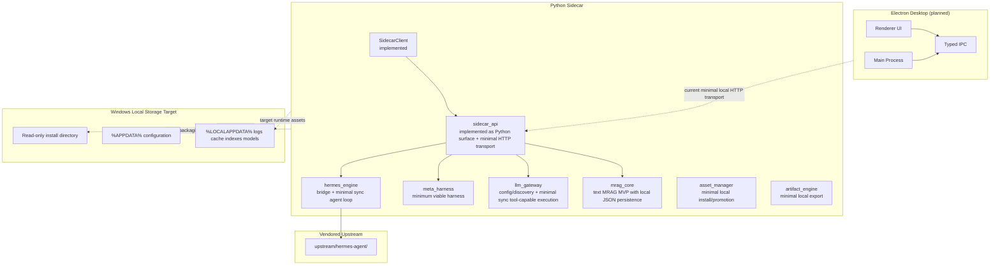
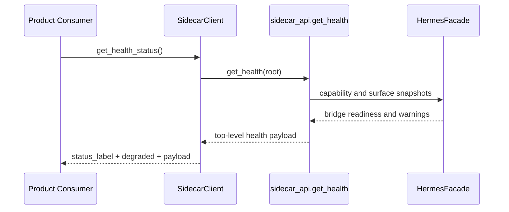
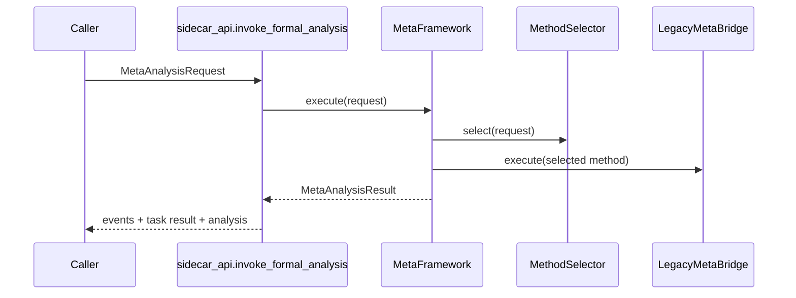
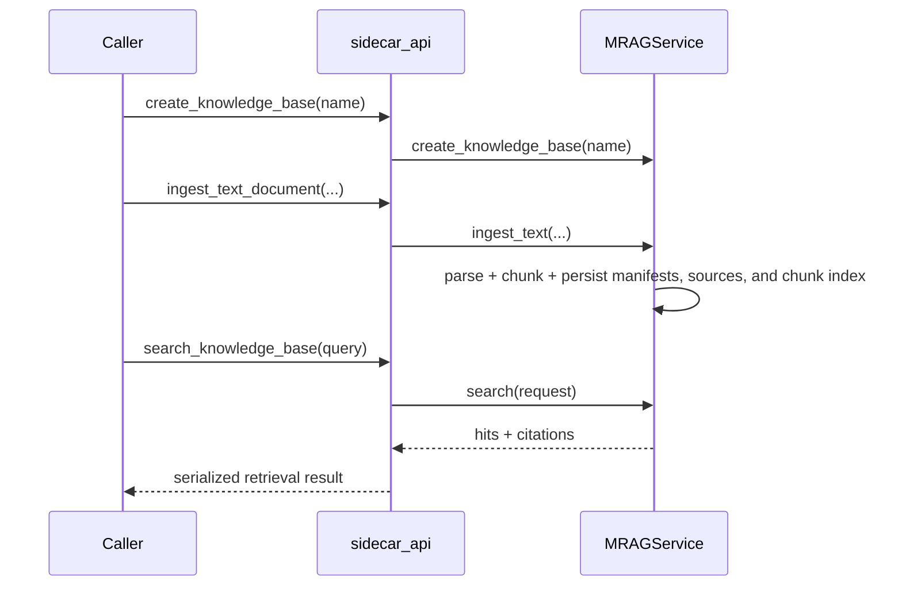

# PycHermesAgent Solution Architecture

| Field | Value |
| --- | --- |
| Date | 2026-05-15 |
| Version | v0.2.0 |
| Author | 彭耀成 |
| Status | Current-State and Target-State Architecture |

## Purpose

This document turns the Phase 0 architecture baseline into a concrete system view that distinguishes:

1. What is already implemented
2. What is partially implemented
3. What remains planned

It is intended to prevent the architecture from drifting into a full-product narrative that the current repository does not yet satisfy.

## Current Product Positioning

The most accurate current description of PycHermesAgent is:

- A local-first methodology and memory enhancement layer
- A sidecar-facing analysis and retrieval surface
- A minimal synchronous Agent runtime foundation with sidecar exposure
- Not yet a standalone full production agent runtime or desktop product

This positioning matters because the repository still lacks a production-grade LLM execution runtime, Electron shell, and production-grade asset/artifact subsystems.

## System Overview



## Layer Responsibilities

| Layer | Responsibility | Current State | Primary Files |
| --- | --- | --- | --- |
| `desktop shell` | Electron host, renderer UX, IPC, packaging shell | Planned only | Not yet present in repo |
| `sidecar_api` | Stable local contract for health, snapshots, formal analysis, MRAG, and agent-loop exposure | Implemented as Python call surface plus minimal local HTTP transport | `src/pyc_hermes_agent/sidecar_api/service.py`, `src/pyc_hermes_agent/sidecar_api/http_server.py` |
| `hermes_engine` | Hermes discovery, runtime seam, tool registry, and sync agent loop ownership | Implemented for snapshot/bridge health and minimal synchronous loop | `src/pyc_hermes_agent/hermes_engine/runtime.py`, `src/pyc_hermes_agent/hermes_engine/tool_registry.py`, `src/pyc_hermes_agent/hermes_engine/agent_loop.py` |
| `meta_harness` | Method routing, logic review, reasonableness review, degraded-state output | Implemented as minimum viable harness | `src/pyc_hermes_agent/meta_harness/kernel/framework.py` |
| `llm_gateway` | Provider/model/config compatibility and synchronous model execution | Implemented for config/catalog plus minimal OpenAI-compatible sync execution | `src/pyc_hermes_agent/llm_gateway/*.py` |
| `mrag_core` | Knowledge-base ingest, chunking, retrieval, evidence packaging | Implemented as text MVP with minimal local JSON persistence | `src/pyc_hermes_agent/mrag_core/service.py`, `src/pyc_hermes_agent/mrag_core/persistence.py` |
| `asset_manager` | Model/runtime asset install and promotion | Partial: checksum-validated local install and atomic promotion foundation | `src/pyc_hermes_agent/asset_manager/__init__.py` |
| `artifact_engine` | Artifact generation and export | Partial: local artifact export and task-artifact metadata foundation | `src/pyc_hermes_agent/artifact_engine/__init__.py` |

## Current Runtime Shape

The repository currently supports an in-process Python usage model and a minimal loopback HTTP transport:

1. Import the package.
2. Call `sidecar_api` functions directly, or run the local HTTP sidecar transport.
3. Use `SidecarClient` for top-level health semantics in-process or over HTTP.
4. Use contract tests to validate interfaces.

The repository does not yet provide:

1. A production-grade local transport with authentication, lifecycle control, and observability
2. A named-pipe or socket sidecar transport
3. An Electron desktop shell
4. A production service supervisor model
5. Reflection and retry-budgeted orchestration
6. Agent-loop streaming responses

## Key Runtime Flows

### Health and Hermes Bridge Flow



Contract rule:

- First-read readiness is anchored to top-level `status_label`.
- Nested `hermes` data is diagnostic detail only.

### Formal Analysis Flow



Formal analysis remains subject to the project boundary that all formal analysis must go through `MetaFramework.execute()`.

### Minimal Agent Loop Flow

```mermaid
sequenceDiagram
    participant Caller as Caller
    participant API as sidecar_api.run_agent_loop
    participant Loop as hermes_engine.AgentLoop
    participant LLM as llm_gateway.execute_chat
    participant Tool as ToolRegistry
    participant Harness as MetaFramework

    Caller->>API: AgentLoopRequest
    API->>Loop: run(request)
    Loop->>LLM: execute_chat(messages, tools)
    LLM-->>Loop: assistant message + tool_calls
    Loop->>Tool: dispatch(tool_call)
    Tool->>Harness: execute() for formal_analysis
    Tool-->>Loop: tool result
    Loop->>LLM: re-call with appended tool message
    LLM-->>Loop: final assistant message
    Loop-->>API: AgentLoopResult
    API-->>Caller: serialized loop result
```

Boundary rule:

- `hermes_engine` owns loop control and tool dispatch.
- `sidecar_api` exposes the loop but does not own orchestration.
- `meta_harness` participates as explicit callable capability, not as loop owner.

### Knowledge Flow



## Current-State Architecture Assessment

| Area | Assessment | Notes |
| --- | --- | --- |
| Governance and boundaries | Strong | Docs and package boundaries are explicit and mostly enforced by structure |
| Contracts | Strong | Dataclass contracts and contract tests are in place |
| Hermes bridge seam | Moderate | Real bridge exists and `hermes_engine` now owns a minimal sync loop, local session history, bounded memory injection, heuristic planning, bounded recovery retries, and hybrid agent-loop streaming with assistant text deltas, streamed tool-call formation, stable event metadata, plus event-oriented lifecycle updates, but not full runtime hardening or richer full-loop token streaming |
| MetaHarness | Moderate | Works as an MVP, but selection and execution policies remain heuristic |
| LLM execution runtime | Moderate | Minimal provider execution and tool-call parsing exist, but runtime breadth is still limited |
| MRAG persistence | Moderate | Minimal local JSON persistence exists, but not a production storage/index model |
| Packaging/runtime assets | Weak | Target rules documented, implementation mostly absent |
| Desktop product integration | Missing | No Electron shell in repo |

## External Assessment Disposition

The 2026-05-15 external productization review is directionally useful, but some statements are already partially outdated by current code.

| Topic | Disposition | Current Position |
| --- | --- | --- |
| No sidecar transport | Partially outdated | A minimal loopback HTTP transport now exists; production-grade transport still does not |
| No persistence | Partially outdated | MRAG now has minimal local JSON persistence; production-grade storage is still missing |
| No LLM runtime execution | Partially outdated | Minimal OpenAI-compatible synchronous execution now exists, but broad production-grade runtime coverage still does not |
| No Electron shell | Accepted | Still true |
| MetaHarness too heuristic | Accepted | Still true |
| Health semantics not standardized across transport and ops | Accepted | Still true at production level |
| Test coverage insufficient for release | Accepted | Still true |
| Dependency management incomplete | Partially addressed | `numpy` is declared; broader runtime dependency coverage remains incomplete |

## Target Architecture Exit Criteria

The architecture should not be considered fully delivered until all of the following exist:

1. A production-grade sidecar transport layer with versioned local API boundaries
2. A production-capable LLM execution path inside `llm_gateway`
3. Persistent MRAG storage with physical separation of indexes, sources, and artifacts
4. Implemented `asset_manager` and `artifact_engine`
5. Electron desktop shell integration
6. End-to-end integration tests across desktop, sidecar, Hermes seam, MetaHarness, and MRAG

## Related Documents

- `docs/architecture/PycHermesAgent_Architecture_v0.2.0.md`
- `docs/architecture/Phase1_Roadmap_v0.2.0.md`
- `docs/design/PycHermesAgent_Detailed_Design_v0.2.0.md`
- `docs/features/PycHermesAgent_Feature_Details_v0.2.0.md`
- `docs/deployment/PycHermesAgent_Usage_Deployment_Guide_v0.2.0.md`
