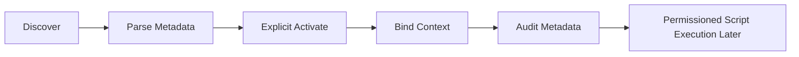

# PycHermesAgent Detailed Design v0.2.0

**Status:** Detailed design for production-bound development
**Governance:** `docs/Project_Development_and_Release_Governance.md`

## 1. Design Goals

This document defines how PycHermesAgent must evolve from the current engineering preview into a production-grade local-first agent platform. It is implementation-oriented and must be updated whenever contracts, storage layouts, runtime flows, or release gates change.

## 2. Package Topology

| Package | Current Role | Next Production Design Step |
|---------|--------------|-----------------------------|
| `contracts` | Shared dataclass contracts | Add versioned trace and error context when contracts change |
| `common` | Runtime paths and sidecar client | Keep path policy aligned with install/local data rules |
| `sidecar_api` | Python service + HTTP/SSE transport | Harden error, trace, request ID, asset/artifact routes |
| `llm_gateway` | Provider config and chat runtime | Keep provider-native objects contained; improve provider test matrix |
| `hermes_engine` | AgentLoop, sessions, memory, tools | Add explicit skill activation and stronger memory/search contracts |
| `meta_harness` | Formal analysis harness | Add dependency-aware capabilities and benchmark value proof |
| `mrag_core` | Local retrieval and persistence | Add storage ownership, migration, file/url ingest, richer retrieval |
| `asset_manager` | Local model asset foundation | Expose through sidecar only after release-safe contract design |
| `artifact_engine` | Local artifact export foundation | Expose task artifact routes and metadata compatibility |

## 3. Sidecar Design

The sidecar is the stable local product surface. It may expose orchestration but must not own business state machines that belong to `hermes_engine`, `meta_harness`, or `mrag_core`.

Required HTTP/SSE properties:

- JSON errors use a standard envelope.
- Streaming events include terminal state.
- Request IDs are generated or propagated.
- Agent loop trace IDs remain separate from request IDs.
- Health status distinguishes ready, degraded, unavailable, and ready-with-warnings.

Future routes should be added only with contract tests and client coverage.

## 4. MRAG Storage Ownership Design

The current JSON persistence is acceptable only with an explicit ownership guardrail.

Design requirements:

- A storage root must have a single active owner or lock.
- Same-process reuse is allowed.
- Second-process writes must fail with a structured sidecar error.
- Lock files must be in the runtime data directory, not the install directory.
- Lock behavior must be tested with restart and cleanup paths.
- Index manifests must include version fields.

Production migration path:

1. Locked JSON MVP.
2. Index format check and rebuild behavior.
3. SQLite/FTS5 or vector index decision record.
4. Optional embeddings/reranking after storage migration rules exist.

## 5. Trace and Error Design

Trace data exists for operator diagnosis, not for model prompting.

Required fields:

| Field | Meaning |
|-------|---------|
| `request_id` | External sidecar request correlation |
| `trace_id` | Agent loop execution trace |
| `sequence` | Ordered streaming event sequence |
| `task_id` | Task or operation identity when available |
| `error.code` | Stable machine-readable error |
| `error.category` | Transport, validation, provider, storage, runtime, or degraded |

Every new route must specify whether it emits request IDs, trace IDs, or both.

## 6. Skill Runtime Lifecycle Design

Skill handling must be explicit and auditable.



Phase 1 supports discovery, parsing, explicit activation, and context binding. Script execution is not permitted until a permission model, sandbox policy, and audit trail exist.

Skill context binding rules:

- Never inject all discovered skills by default.
- Bind only explicitly requested skills.
- Preserve source path and metadata in trace/audit payloads.
- Do not let skill content override `AGENTS.md` or governance constraints.

## 7. MetaHarness Value Proof Design

MetaHarness must demonstrate reliability value. All formal analysis remains routed through `MetaFramework.execute()`; benchmark and dependency improvements must strengthen that entry point rather than create a parallel API.

Required implementation direction:

- `CapabilityRegistry.is_dependency_available()` must reflect real capability status.
- `LegacyMetaBridge` must expose capability status without requiring execution side effects.
- `MethodSelector` must consider task type, data shape, and method preconditions.
- `MethodJudge` and `QualityChecker` must identify method-specific risks.
- Benchmark tests must compare baseline behavior to MetaHarness-guided behavior.

Benchmark dimensions:

| Dimension | Example Metric |
|-----------|----------------|
| Causal boundary | Overclaim reduction |
| Method choice | Correct method selection rate |
| Risk review | Missed high-risk issue rate |
| Evidence grade | Correct CE/SR separation |
| Degraded state | Correct unavailable/degraded labeling |

## 8. LLM Gateway Design

`llm_gateway` is the only provider runtime boundary.

Rules:

- Model IDs use `provider/model` format.
- Provider-specific headers, tokens, refresh behavior, and native responses remain inside `llm_gateway`.
- Errors crossing the boundary must be normalized.
- Streaming parsers must have mock-provider tests.
- Free-first model presentation remains the default.

## 9. Asset and Artifact Design

Asset and artifact services are separate domains.

- `asset_manager` owns model/runtime asset manifests, checksums, staging, promotion, and inventory.
- `artifact_engine` owns task outputs, metadata, checksums, and export records.
- Neither service may store MRAG indexes or chat memory.
- Sidecar routes for these services must be versioned and covered by contract tests before desktop integration.

## 10. Desktop Design Preconditions

Electron desktop work may begin after:

- sidecar health/error/trace semantics are stable,
- MRAG storage ownership is protected,
- runtime paths and packaging constraints are enforced,
- release gates can distinguish preview vs production,
- asset/artifact APIs are stable enough for UI consumption.

## 11. Verification Requirements

Minimum command:

```bash
./.venv/bin/python -m pytest tests/contract
```

Scope-specific requirements:

- MRAG: lock, restart, index version, retrieval tests.
- LLM: mock provider, auth failure, SSE parsing tests.
- AgentLoop: tool call, retry, session persistence, stream tests.
- MetaHarness: routing, degraded, benchmark smoke tests.
- Packaging: runtime path and asset promotion tests.
- Release: status classification, secret scan, release note checks.
